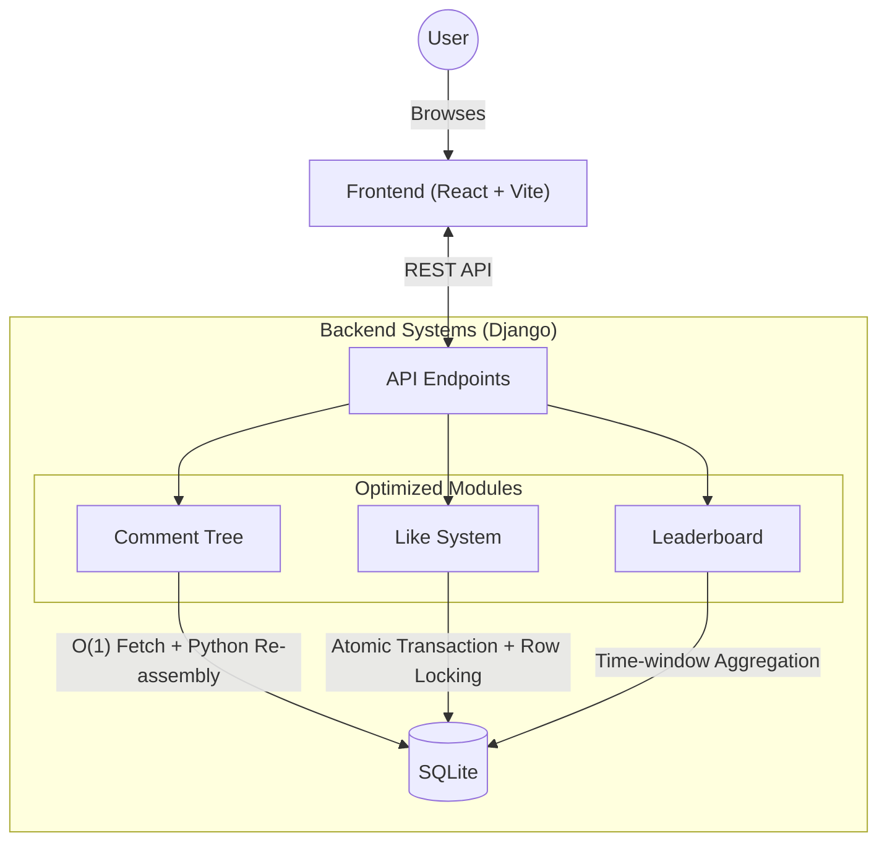

# Playto Community Feed 🚀

This project is a **full-stack community feed application** built as an assignment. It features threaded discussions (Reddit-style), a real-time responsive UI, and a dynamic 24-hour leaderboard.

The goal was to build a performant, race-condition-free system with a clean architecture and efficient database queries.

## 🛠️ Tech Stack

- **Backend**: Django 5 + Django Rest Framework (DRF)
- **Frontend**: React (Vite) + Tailwind CSS
- **Database**: SQLite (for simplicity and portability)

---

## 📂 Project Structure

Here is a breakdown of the codebase organization:

### `backend/` (Django)
This folder contains the core API logic and database management.
- **`api/`**: The main application app.
    - `models.py`: Defines the database schema (User, Post, Comment, Like, KarmaTransaction).
    - `serializers.py`: Handles data transformation, including the **recursive logic** for the efficient comment tree.
    - `views.py`: API endpoints that the frontend consumes.
- **`manage.py`**: Django's CLI utility for running the server and migrations.

### `frontend/` (React)
The client-side interface that users interact with.
- **`src/components/`**: Modular UI components.
    - `CommentList.jsx`: Renders the nested, threaded comments components.
    - `Leaderboard.jsx`: Displays top users based on recent activity.
- **`src/api/`**: Contains `api.js` for centralized backend API calls.

---

## 🔄 System Architecture & Flow

The following diagram illustrates the application flow, detailing how the Frontend communicates with the Backend and how the 'Optimized Modules' handle data.



### Key Optimizations
1.  **Nested Comments**: We solved the N+1 query problem by fetching all comments in O(1) and assembling the tree structure in-memory (Python), ensuring fast load times regardless of thread depth.
2.  **Concurrency (Likes)**: Used atomic transactions and row locking (`select_for_update`) to prevent race conditions when multiple users like the same post simultaneously.
3.  **Dynamic Leaderboard**: Calculates user scores based on a rolling 24-hour window rather than stored static values.

---

## 🚀 Getting Started

Follow these steps to set up and run the project locally.

### Prerequisites
- **Python** (version 3.10 or higher)
- **Node.js** & **npm**

### 1. Backend Setup
Initialize the Django server and database.

```bash
# 1. Open a terminal and navigate to the backend folder
cd backend

# 2. Create a virtual environment (Optional but Recommended)
python -m venv .venv

# Activate the virtual environment:
# Windows:
.venv\Scripts\activate
# Mac/Linux:
source .venv/bin/activate

# 3. Install Python dependencies
pip install -r requirements.txt

# 4. Run database migrations to create tables
python manage.py migrate

# 5. Start the server (runs on http://127.0.0.1:8000)
python manage.py runserver
```

### 2. Frontend Setup
Launch the React user interface.

```bash
# 1. Open a NEW terminal window and navigate to the frontend folder
cd frontend

# 2. Install JavaScript dependencies
npm install

# 3. Start the development server
npm run dev
```

Once running, visit the link shown in your terminal (usually **http://localhost:5173**) to view the app!

---

## 🧪 Running Tests
To verify the specific backend logic (like the race-condition safety):

```bash
cd backend
python manage.py test api
```

---

## 🔮 Future Roadmap

Given more time, here are the improvements I would implement:

1.  **Authentication**: Switch from basic session handling to **JWT (JSON Web Tokens)** for stateless, secure authentication.
2.  **Real-time Updates**: Integrate **Django Channels (WebSockets)** so likes and comments appear instantly without page refreshes.
3.  **Deployment**: Dockerize the application and deploy it to AWS/Render with a PostgreSQL database for production scalability.
4.  **Pagination**: Implement cursor-based pagination for the infinite scroll feed.

---

## 👨‍💻 Author

**Sumit Kumawat**  
*Built for the Full-Stack Developer Assignment.*
